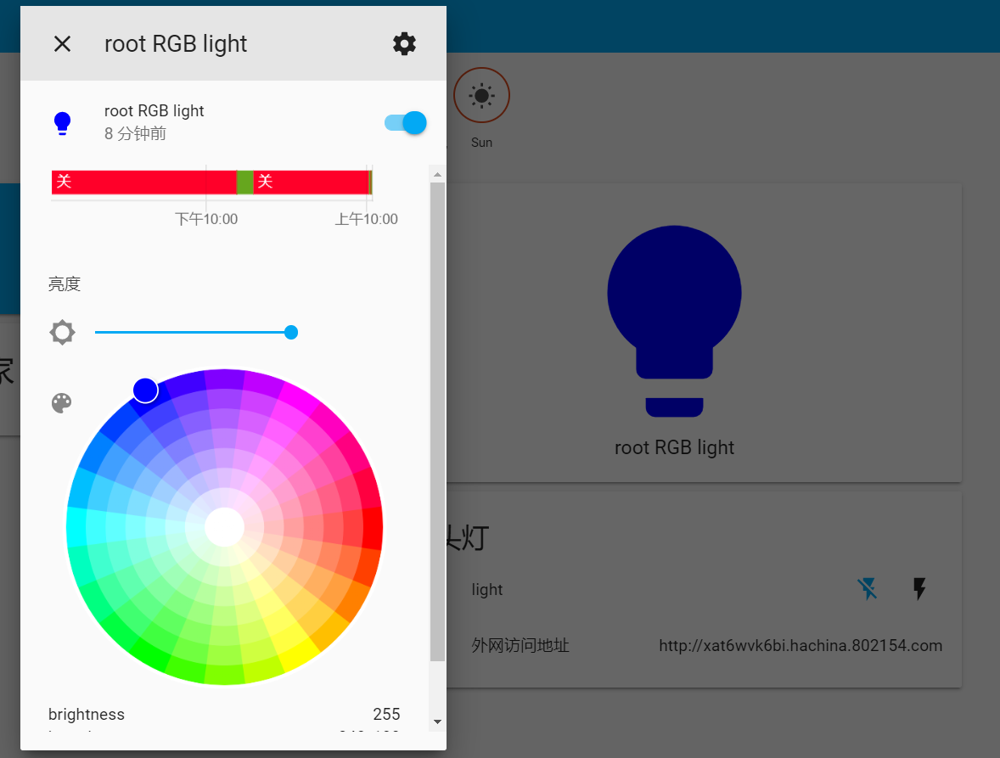
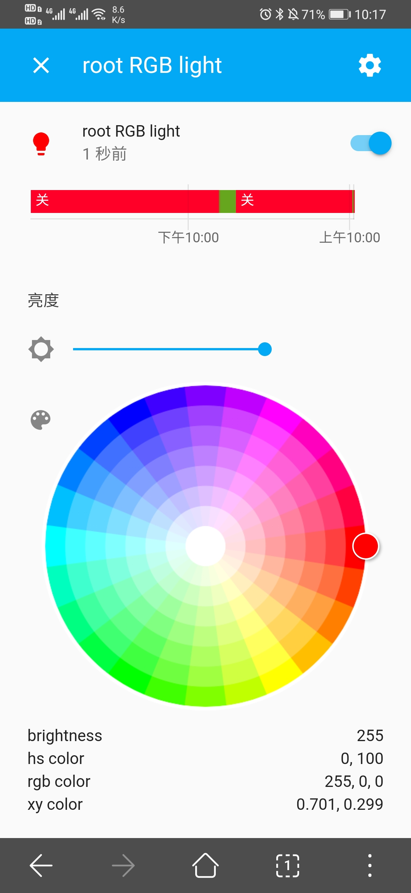
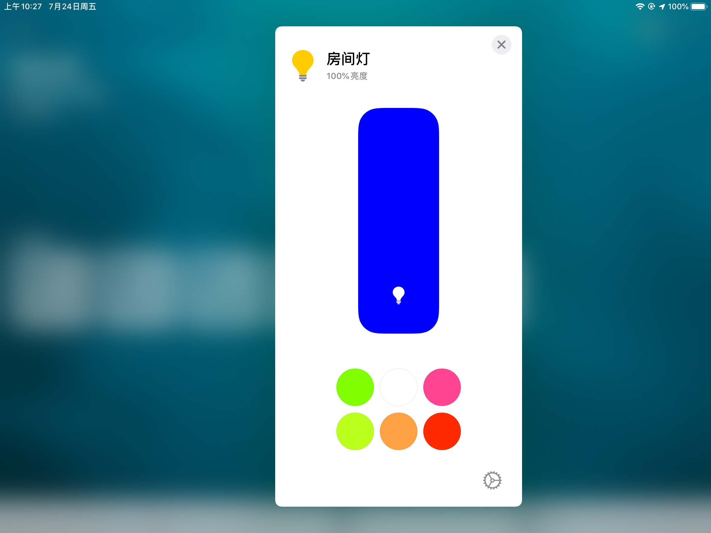
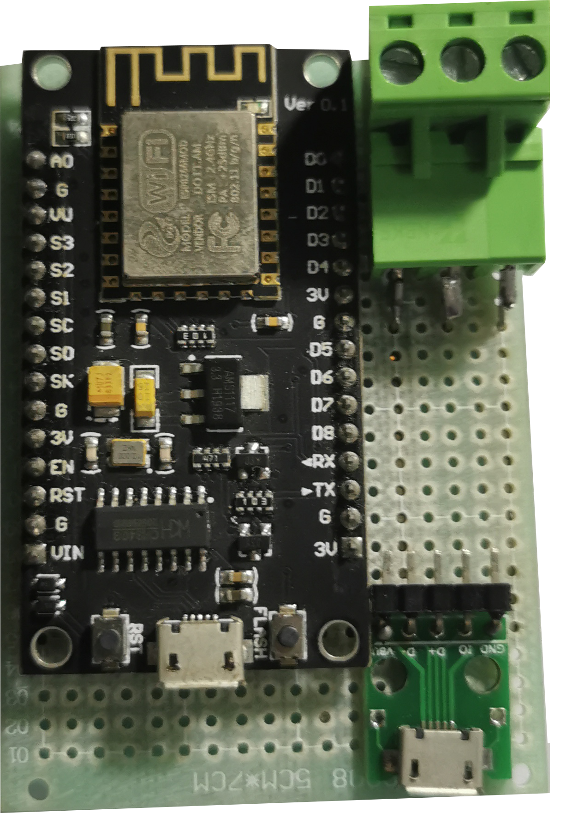

# RGB床头灯

### 一.功能介绍

RGB床头，通过WIFI连接至服务器，实现远程操控RGB灯。

### 二.无线控制

PC端

手机端

苹果HomeKit端

### 三.复现

1.材料

WS2812灯带->15个灯珠->￥10.00

https://item.taobao.com/item.htm?spm=a1z09.2.0.0.4fa02e8d4E42uP&id=523924102690&_u=o2lrp5mbfd62

洞洞PCB板5*7->1块->￥2.49

https://detail.tmall.com/item.htm?id=525489414251&spm=a1z09.2.0.0.4fa02e8d4E42uP&_u=o2lrp5mbe36b

插拔式接线端子PCB连接器->直针座+3P接线端子（5套）->￥3.35

https://buyertrade.taobao.com/trade/itemlist/list_bought_items.htm?spm=a21bo.2017.1997525045.2.5af911d9oclzMJ

ESP8266开发板->￥12.80

https://item.taobao.com/item.htm?spm=a1z09.2.0.0.4fa02e8d4E42uP&id=531755241333&_u=o2lrp5mb9615

MICRO USB转DIP->￥0.28

https://item.taobao.com/item.htm?spm=a1z09.2.0.0.4fa02e8d4E42uP&id=45267918167&_u=o2lrp5mb1146

LED嵌入式灯条框架->50cm->￥9.60

https://item.taobao.com/item.htm?spm=a1z09.2.0.0.4fa02e8d4E42uP&id=613747700406&_u=o2lrp5mb6b96

3D打印外壳->￥16+

https://detail.tmall.com/item.htm?id=611650162725&spm=a1z09.2.0.0.4fa02e8d4E42uP&_u=o2lrp5mba32b

M2螺丝

https://buyertrade.taobao.com/trade/itemlist/list_bought_items.htm?spm=a21bo.2017.1997525045.2.5af911d9oclzMJ

板图如下：

##### 复现过程

1.将PCB焊接好。

2.通过Arduino修改程序上的SSID和密码，通过板子上的USB口进行程序写入，程序位于`code`文件夹下

3.将PCB板装进外壳并上螺丝

4.配置Homeassistant并连接Homekit即可

# 注意：

该项目存在许多BUG，请勿尝试复现，程序代码是完美运行，3D打印存在许多问题。

